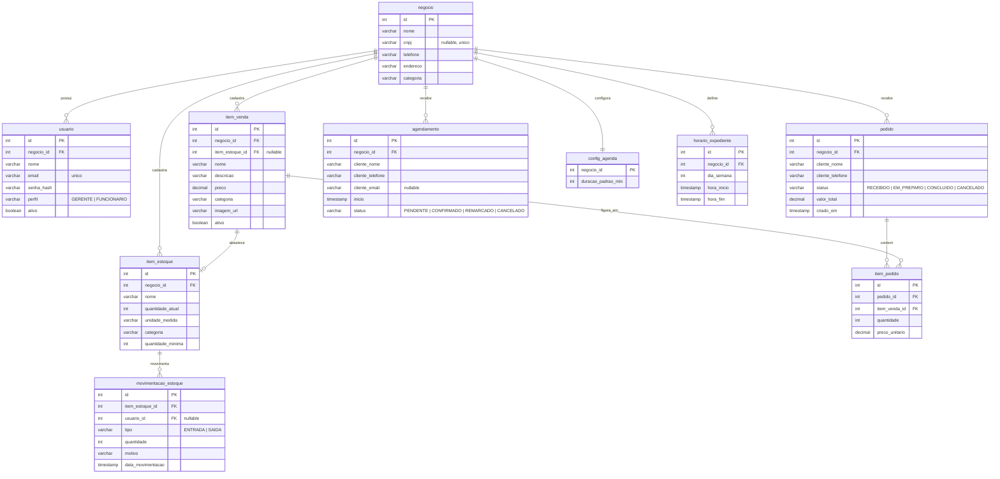
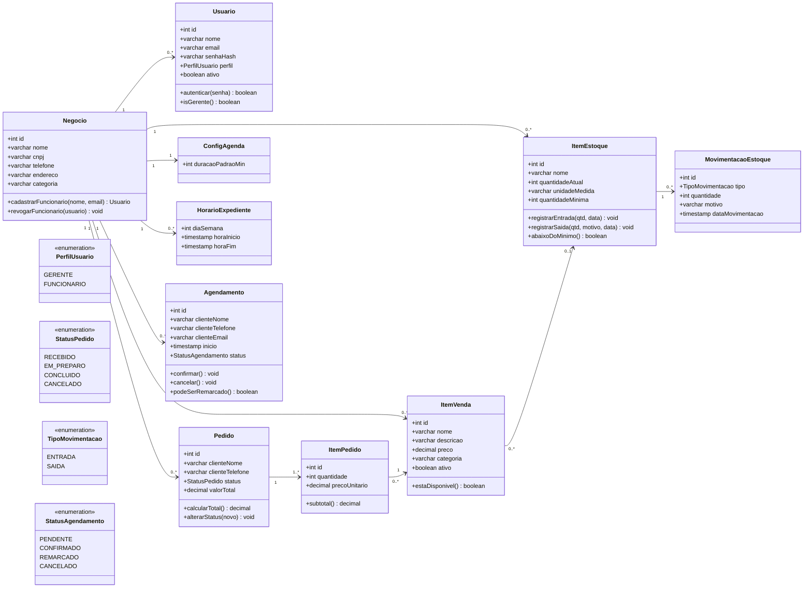

# Modelagem de Banco de Dados — Conecta+

**Versão:** 1.0 
**SGBD de referência:** Supabase PostgreSQL

---

## 1. Visão geral

Modelo enxuto para os três módulos do sistema (Mercado, Estoque e Agenda) mais a conta do negócio.

- Toda tabela tem `id` como chave primária.
- Toda tabela de dados de negócio tem `negocio_id` (cada conta = um único negócio).
- Autenticação de apoio (bloqueio por tentativas, token de redefinição de senha, log de auditoria, e-mails) fica na **camada da aplicação** e não foi modelada como tabela, para reduzir complexidade.
- Senhas são gravadas apenas como hash (bcrypt).

**Tabelas:** `negocio`, `usuario`, `item_venda`, `pedido`, `item_pedido`, `item_estoque`, `movimentacao_estoque`, `config_agenda`, `horario_expediente`, `agendamento`.

---

## 2. Diagrama entidade-relacionamento

---

## 3. Diagrama de classes

Mesmas entidades em forma de classe, com os poucos métodos que carregam regra de negócio.

---

## 4. Dicionário de dados (resumido)

| Tabela | Colunas principais | Observações |
|---|---|---|
| **negocio** | id, nome, cnpj, telefone, endereco, categoria | `cnpj` opcional e único quando preenchido (RF02A–C) |
| **usuario** | id, negocio_id, nome, email, senha_hash, perfil, ativo | `email` único (RF02); `perfil` GERENTE/FUNCIONARIO (RF11); `ativo=false` revoga acesso (RF10) |
| **item_venda** | id, negocio_id, item_estoque_id, nome, descricao, preco, categoria, imagem_url, ativo | `preco > 0` (RN03); vitrine mostra só `ativo=true` (RF16); `item_estoque_id` opcional (RF25, RN01) |
| **pedido** | id, negocio_id, cliente_nome, cliente_telefone, status, valor_total, criado_em | Cliente sem login (RF18); `status` com 4 valores (RF20); `criado_em` usado nos relatórios (RF40) |
| **item_pedido** | id, pedido_id, item_venda_id, quantidade, preco_unitario | `preco_unitario` = cópia do preço no momento do pedido |
| **item_estoque** | id, negocio_id, nome, quantidade_atual, unidade_medida, categoria, quantidade_minima | Alerta quando `quantidade_atual <= quantidade_minima` (RF28); `quantidade_minima >= 0` (RN04) |
| **movimentacao_estoque** | id, item_estoque_id, usuario_id, tipo, quantidade, motivo, data_movimentacao | `tipo` ENTRADA/SAIDA (RF24, RF27); `motivo` obrigatório na saída; `usuario_id` = responsável (RF29) |
| **config_agenda** | negocio_id, duracao_padrao_min | 1 registro por negócio (RF32) |
| **horario_expediente** | id, negocio_id, dia_semana, hora_inicio, hora_fim | Dias e faixas de atendimento (RF31) |
| **agendamento** | id, negocio_id, cliente_nome, cliente_telefone, cliente_email, inicio, status | `status` com 4 valores (RF37); histórico por telefone (RF39) |

---

## 5. Regras de negócio no sistema

Implementadas na camada de aplicação (Model/serviços), não só no banco:

| Regra | Descrição |
|---|---|
| RF21 | Quando `item_estoque.quantidade_atual` chega a 0, o `item_venda` associado sai da vitrine (`ativo=false`). |
| RF26 | Ao mudar `pedido.status` para `CONCLUIDO`, gera `movimentacao_estoque` de SAIDA e abate o estoque associado. |
| RF24 / RF27 | Toda movimentação atualiza `item_estoque.quantidade_atual`. |
| RF35 | Não pode haver dois agendamentos `CONFIRMADO` no mesmo horário. |
| RN01 | Um `item_venda` associa-se a no máximo um `item_estoque` (`item_estoque_id` único). |
| RN02 | Agendamento `CONCLUIDO`/`CANCELADO` não pode ser remarcado. |
| RN03 | `item_venda.preco` deve ser maior que zero. |
| RN04 | `item_estoque.quantidade_minima` não pode ser negativa. |

**Relatórios (RF40–RF43):** são consultas por intervalo de datas sobre `pedido`, `movimentacao_estoque` e `agendamento`. Não precisam de tabelas próprias.

---

## 6. Ponto a confirmar

O RF34 pede só nome e telefone no agendamento, mas o RF38 exige avisar o Cliente **por e-mail**. Por isso `agendamento.cliente_email` é opcional — o time precisa decidir se o formulário público vai pedir e-mail.
